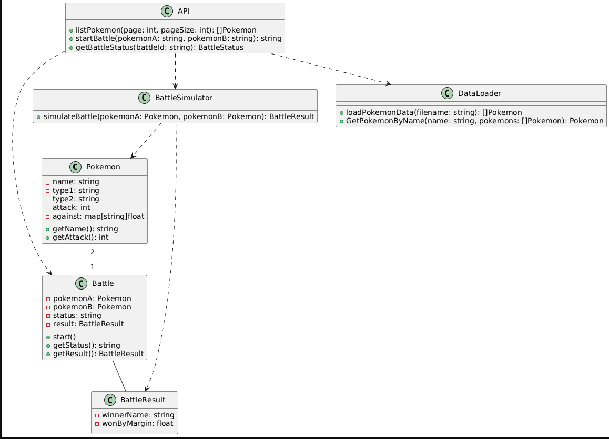

# Pokemon Battle Simulator

This project implements a Pokémon Battle Simulator. It provides APIs for listing Pokémon, initiating battles, and retrieving battle results.

## Table of Contents
1. [CSV Data Handling](#csv-data-handling)
2. [Battle Simulation Logic](#battle-simulation-logic)
3. [API Endpoints](#api-endpoints)
4. [Pokémon Name Validation](#pokémon-name-validation)
5. [Asynchronous Battle Processing](#asynchronous-battle-processing)
6. [Error Handling](#error-handling)
7. [Testing](#testing)
8. [UML Class Diagram](#uml-class-diagram)

## CSV Data Handling

- The Pokémon dataset is loaded from a CSV file using Go's `encoding/csv` package.
- We use the `load.LoadDataset()` function to read and parse the CSV file.
- Each row in the CSV is converted into a `LoadPokemon` struct, which embeds the `BasePokemon` struct.
- The loaded data is stored in memory for quick access during battles.

## Normalizing GetPocketByName
- Normalizing input to lowercase
- Accepting one-word spelling mistakes
- Rejecting inputs with more significant differences

## Battle Simulation Logic

- Battles are simulated using the `battle.Battle()` function.
- The damage calculation follows the formula provided in the assignment:
- Two rounds are simulated: Pokémon A attacking B, and B attacking A.
- The Pokémon dealing more damage is declared the winner.

## API Endpoints

1. **List Pokémon (API 1)**
 - Endpoint: `GET /pokemon`
 - Supports pagination with `page` and `pageSize` query parameters.

2. **Initiate Battle (API 2)**
 - Endpoint: `POST /battle`
 - Accepts JSON body with `pokemonA` and `pokemonB` names.
 - Returns a battle ID (UUID4 format) for asynchronous processing.

3. **Get Battle Status (API 3)**
 - Endpoint: `GET /battle/{battleId}`
 - Returns the current status and result (if available) of the specified battle.

## Pokémon Name Validation

- Pokémon names are normalized to lowercase for comparison.
- We use the Levenshtein distance algorithm to handle one-word spelling mistakes.
- The `GetPokemonByName()` function in the `load` package implements this logic.

## Asynchronous Battle Processing

- Battles are processed asynchronously using goroutines.
- When a battle is initiated, it's added to a queue and processed in the background.
- The battle status can be checked using the battle ID returned by API 2.

## Error Handling

- Custom error types are defined for various scenarios (e.g., `ErrPokemonNotFound`).
- API responses include appropriate HTTP status codes and error messages.

## UML Class Diagram

- The UML class diagram is included in the repository as `uml_class_diagram.png`.
- It illustrates the relationships between key classes such as `BasePokemon`, `LoadPokemon`, `BattlePokemon`, and the API handlers.
- 

## Running the Project

1. Clone the repository
2. Install dependencies: `go mod tidy`
3. Run the server: `go run cmd/main.go`
4. Access the API at `http://localhost:8000`

## License

This project is licensed under the MIT License - see the [LICENSE.md](LICENSE.md) file for details.

